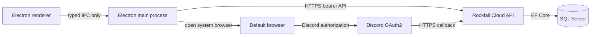
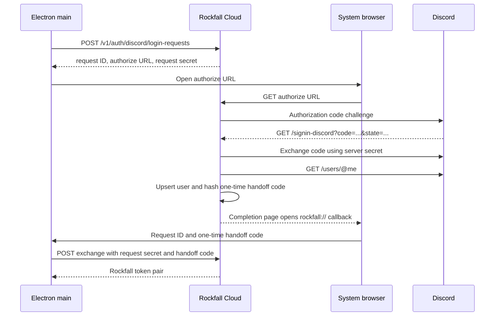

# Rockfall Cloud Ownership Service

Status: implementation specification
Last reviewed: 2026-07-27

This document specifies the service that synchronizes Rockfall blueprint
ownership between installations. It is also an ordered implementation guide for
GitHub Copilot.

## 1. Decision summary

Build Rockfall Cloud as an independently deployable ASP.NET Core service with:

- .NET 10 LTS and ASP.NET Core 10;
- Entity Framework Core 10;
- SQL Server 2022 or later, with Azure SQL also supported;
- Discord OAuth2 using the authorization code grant and the `identify` scope;
- short-lived Rockfall JWT access tokens and rotating opaque refresh tokens;
- an offline-first, operation-based synchronization API;
- OpenAPI as the published HTTP contract;
- Docker-based local development and deployment artifacts.

The service should live in a separate `rockfall-cloud` repository so backend
deployment and secrets are isolated from desktop releases. This specification
remains in the desktop repository because it defines the shared contract.

The Electron app remains authoritative while offline. The cloud service stores
only user identity, Star Citizen profile metadata, log-derived receipts, manual
ownership state, devices, and synchronization metadata. It does not store the
blueprint catalog.

## 2. Goals

1. Restore acquired blueprint data after reinstalling Rockfall.
2. Synchronize ownership across multiple PCs signed into the same Discord
   account.
3. Preserve Rockfall's existing per-channel and per-Star-Citizen-account
   separation.
4. Continue working normally without network access or a signed-in user.
5. Prevent stale clients and retried requests from duplicating or resurrecting
   state.
6. Keep Discord credentials and service secrets out of the desktop package.
7. Ensure one Rockfall user can never read or modify another user's records.
8. Provide account export, session revocation, and account deletion.

## 3. Non-goals

- Authenticating users with a Star Citizen account.
- Treating the account ID parsed from `Game.log` as proof of identity.
- Reading or reconstructing the complete server-side Star Citizen inventory.
- Storing the static blueprint catalog, item details, icons, or game archives.
- Synchronizing mining settings or overlay layout in version 1.
- Real-time push notifications. Clients synchronize at defined local events and
  on a bounded timer.
- Discord guild membership, roles, email, friends, or other Discord data.

## 4. Existing client behavior

Rockfall currently writes `blueprint-ownership.json` under Electron's
`userData` directory. Its schema contains up to 30 profiles. Each profile is
scoped by:

- game channel, such as `LIVE` or `PTU`;
- the numeric account ID parsed from `Game.log`;
- the most recently observed Star Citizen handle.

Each profile stores:

- log receipts keyed by a normalized blueprint name, with first- and last-seen
  timestamps;
- manual marks containing both a blueprint ID and a blueprint key.

Ownership has three sources:

- `default`: derived from the local catalog and never persisted or uploaded;
- `log`: derived from `Received Blueprint` log messages;
- `manual`: explicitly marked or cleared by the user.

The cloud design must preserve those semantics. In particular, a missing log
receipt does not prove that the user lacks a blueprint.

## 5. System architecture



Trust boundaries:

- The renderer must not receive access tokens, refresh tokens, Discord tokens,
  or service secrets.
- All network and token operations run in the Electron main process.
- The Electron app is a public client and cannot safely hold a Discord client
  secret.
- Rockfall Cloud is the confidential Discord OAuth client. Discord redirects
  only to an HTTPS endpoint on Rockfall Cloud.
- Every database query for user data is scoped with the authenticated Rockfall
  user ID. Request payloads never select a Rockfall user ID.

## 6. Technology and repository baseline

### 6.1 Runtime

| Concern           | Requirement                                                   |
| ----------------- | ------------------------------------------------------------- |
| Runtime           | Latest serviced .NET 10 LTS patch                             |
| Web framework     | ASP.NET Core 10 controllers                                   |
| ORM               | EF Core 10                                                    |
| Database          | SQL Server 2022+ or Azure SQL                                 |
| SQL provider      | `Microsoft.EntityFrameworkCore.SqlServer`                     |
| API documentation | `Microsoft.AspNetCore.OpenApi`                                |
| Authentication    | ASP.NET Core OAuth, temporary cookie, and JWT bearer          |
| Tests             | xUnit, `WebApplicationFactory`, and SQL Server Testcontainers |

Do not use the EF Core in-memory provider for persistence integration tests. It
does not reproduce SQL Server constraints, transactions, collations, or
concurrency behavior.

### 6.2 Solution layout

```text
Rockfall.Cloud.sln
Directory.Build.props
Directory.Packages.props
src/
  Rockfall.Cloud.Api/
  Rockfall.Cloud.Core/
  Rockfall.Cloud.Infrastructure/
tests/
  Rockfall.Cloud.UnitTests/
  Rockfall.Cloud.IntegrationTests/
```

- `Core` owns domain models, validated commands, interfaces, synchronization
  rules, and no infrastructure dependencies.
- `Infrastructure` owns EF Core, SQL mappings, Discord integration, token
  issuance, hashing, and clock/random implementations.
- `Api` owns composition, authentication configuration, controllers, DTOs,
  OpenAPI, HTTP error mapping, rate limiting, health checks, and hosted cleanup
  jobs.
- Tests reference only the layers they exercise.

Do not add MediatR, a generic repository, AutoMapper, or a service bus. They do
not solve a requirement in this service.

### 6.3 Code conventions

- Enable nullable reference types and implicit usings.
- Treat warnings as errors in service projects.
- Use `DateTimeOffset` in UTC for persisted and API timestamps.
- Use `TimeProvider` instead of direct `DateTimeOffset.UtcNow` calls.
- Use cryptographically secure randomness through an injected abstraction.
- Use camel-case JSON and string enum values.
- Use controllers with explicit request and response DTOs. Never bind EF
  entities directly to HTTP requests.
- Prefix public API routes with `/v1`.
- Return RFC 9457 Problem Details with a stable Rockfall `code` extension.
- Emit an OpenAPI document in development and CI.

## 7. Discord authentication

### 7.1 Provider registration

Create a Discord application for each environment. Configure an HTTPS redirect
URI owned by the service:

```text
https://<service-host>/signin-discord
```

Request only the `identify` scope. The immutable Discord snowflake returned as
`id` is the external identity. Usernames and display names are mutable profile
metadata and must not be used as keys.

The Discord client ID and secret exist only in server-side secret storage.
Never place the secret in source control, a Docker image, an Electron
environment variable, or an application update.

Discord's documented token endpoint requires confidential-client
authentication. Therefore, do not exchange Discord authorization codes in
Electron and do not use the implicit grant.

### 7.2 Browser handoff flow

The desktop sign-in flow is a one-time browser handoff:



Detailed rules:

1. `POST /v1/auth/discord/login-requests` creates a request that expires after
   five minutes.
2. The API returns a random 256-bit request secret exactly once. SQL Server
   stores only its SHA-256 hash. The secret stays in Electron main-process
   memory and is discarded if the sign-in attempt is cancelled or the app
   exits.
3. The app opens the returned HTTPS authorization URL in the user's default
   browser, never an embedded Electron webview.
4. The authorization endpoint validates the request, then invokes ASP.NET
   Core's Discord OAuth challenge.
5. ASP.NET Core generates and validates the OAuth correlation cookie and
   `state`. The login request ID is carried in protected
   `AuthenticationProperties`, not trusted from the callback query string.
6. The OAuth callback exchanges the authorization code server-side, retrieves
   `/users/@me`, and upserts the user by Discord ID.
7. The service does not persist Discord access or refresh tokens. Set
   `SaveTokens = false`; retain only the minimum Discord profile fields.
8. After successful Discord authorization, the service generates a separate
   random 128-bit handoff code and stores only its SHA-256 hash.
9. The completion page displays the requesting device name and attempts to open
   `rockfall://auth/discord` with the login request ID and handoff code. It also
   provides a copy-code fallback. The page warns users not to share the code
   and uses `Cache-Control: no-store`, a restrictive Content Security Policy,
   and `Referrer-Policy: no-referrer`.
10. The custom-protocol URL contains no Discord token, Rockfall access token, or
    Rockfall refresh token. A protocol-handler interceptor learns only the
    handoff code and cannot complete sign-in without the request secret held by
    the initiating Electron process.
11. The app exchanges the request secret and handoff code together. This split
    binding prevents a forwarded authorization URL from giving the initiator
    access to the Discord account of the person who opened it.
12. The first successful exchange atomically consumes the login request and
    issues Rockfall tokens. Later exchanges fail with `409 Conflict`.

### 7.3 Rockfall tokens

Access tokens:

- JWT signed with RS256;
- 10-minute lifetime;
- claims: `sub`, `sid`, `device_id`, `jti`, `iss`, and `aud`;
- `sid` is the stable refresh-token `FamilyId`, not an individual rotated token
  row ID;
- no username, handle, account ID, or blueprint data;
- validated for signature, issuer, audience, lifetime, and signing key ID;
- allowed clock skew no greater than two minutes.

Refresh tokens:

- opaque random values with at least 256 bits of entropy;
- only SHA-256 hashes are stored;
- 30-day inactivity lifetime and 90-day absolute session lifetime;
- rotated on every successful refresh;
- single-use;
- grouped into a token family per device session;
- reuse of a rotated token revokes the entire family;
- logout revokes the current family;
- "log out all devices" revokes every family for the user.

Signing keys and Discord credentials must come from a production secret store.
For local development, use .NET user secrets. Persist ASP.NET Core Data
Protection keys to SQL Server so OAuth correlation survives restarts and
multiple service instances. Protect the persisted key ring with an environment
specific certificate or managed key service.

### 7.4 Desktop token storage

- Keep the access token only in Electron main-process memory.
- Encrypt the refresh token with Electron `safeStorage` before writing it to
  disk.
- If `safeStorage.isEncryptionAvailable()` is false, do not persist the refresh
  token. Keep it only for the process lifetime and explain that sign-in will not
  survive restart.
- Never expose token-bearing IPC methods to arbitrary renderer input.

## 8. Persistence model

Use EF Core migrations and explicit Fluent API mappings. Table and column names
below are contractual; additional indexes or operational columns are allowed.

### 8.1 Tables

#### `Users`

| Column              | SQL type            | Rules                         |
| ------------------- | ------------------- | ----------------------------- |
| `Id`                | `uniqueidentifier`  | Primary key                   |
| `DiscordUserId`     | `varchar(20)`       | Required, digits only, unique |
| `DiscordUsername`   | `nvarchar(32)`      | Required                      |
| `DiscordGlobalName` | `nvarchar(100)`     | Nullable                      |
| `DiscordAvatarHash` | `varchar(128)`      | Nullable                      |
| `CreatedAt`         | `datetimeoffset(7)` | Required                      |
| `UpdatedAt`         | `datetimeoffset(7)` | Required                      |
| `LastLoginAt`       | `datetimeoffset(7)` | Required                      |
| `RowVersion`        | `rowversion`        | Concurrency token             |

Store no Discord email, guild membership, locale, or OAuth token.

#### `LoginRequests`

| Column              | SQL type            | Rules                                          |
| ------------------- | ------------------- | ---------------------------------------------- |
| `Id`                | `uniqueidentifier`  | Primary key                                    |
| `RequestSecretHash` | `binary(32)`        | Required, unique                               |
| `HandoffCodeHash`   | `binary(32)`        | Nullable until Discord authorization           |
| `Status`            | `tinyint`           | Pending, authorized, consumed, failed, expired |
| `UserId`            | `uniqueidentifier`  | Nullable FK until authorized                   |
| `InstallationId`    | `uniqueidentifier`  | Client-generated installation ID               |
| `DeviceName`        | `nvarchar(100)`     | Required                                       |
| `AppVersion`        | `varchar(32)`       | Required                                       |
| `CreatedAt`         | `datetimeoffset(7)` | Required                                       |
| `ExpiresAt`         | `datetimeoffset(7)` | Required, indexed                              |
| `AuthorizedAt`      | `datetimeoffset(7)` | Nullable                                       |
| `ConsumedAt`        | `datetimeoffset(7)` | Nullable                                       |
| `FailureCode`       | `varchar(64)`       | Nullable                                       |
| `RowVersion`        | `rowversion`        | Concurrency token                              |

#### `Devices`

| Column           | SQL type            | Rules             |
| ---------------- | ------------------- | ----------------- |
| `Id`             | `uniqueidentifier`  | Primary key       |
| `UserId`         | `uniqueidentifier`  | Required FK       |
| `InstallationId` | `uniqueidentifier`  | Required          |
| `Name`           | `nvarchar(100)`     | Required          |
| `AppVersion`     | `varchar(32)`       | Required          |
| `CreatedAt`      | `datetimeoffset(7)` | Required          |
| `LastSeenAt`     | `datetimeoffset(7)` | Required          |
| `RevokedAt`      | `datetimeoffset(7)` | Nullable          |
| `RowVersion`     | `rowversion`        | Concurrency token |

Add a unique index on `(UserId, InstallationId)`.

#### `RefreshTokens`

| Column              | SQL type            | Rules                               |
| ------------------- | ------------------- | ----------------------------------- |
| `Id`                | `uniqueidentifier`  | Primary key                         |
| `UserId`            | `uniqueidentifier`  | Required FK                         |
| `DeviceId`          | `uniqueidentifier`  | Required FK                         |
| `FamilyId`          | `uniqueidentifier`  | Required, indexed, stable JWT `sid` |
| `TokenHash`         | `binary(32)`        | Required, unique                    |
| `CreatedAt`         | `datetimeoffset(7)` | Required                            |
| `ExpiresAt`         | `datetimeoffset(7)` | Required                            |
| `AbsoluteExpiresAt` | `datetimeoffset(7)` | Required                            |
| `LastUsedAt`        | `datetimeoffset(7)` | Nullable                            |
| `RevokedAt`         | `datetimeoffset(7)` | Nullable                            |
| `ReplacedByTokenId` | `uniqueidentifier`  | Nullable self FK                    |
| `RevocationReason`  | `nvarchar(200)`     | Nullable                            |
| `RowVersion`        | `rowversion`        | Concurrency token                   |

#### `StarCitizenProfiles`

| Column       | SQL type            | Rules                          |
| ------------ | ------------------- | ------------------------------ |
| `Id`         | `uniqueidentifier`  | Primary key                    |
| `UserId`     | `uniqueidentifier`  | Required FK                    |
| `Channel`    | `varchar(32)`       | Required, uppercase normalized |
| `AccountId`  | `varchar(100)`      | Required, digits only          |
| `Handle`     | `nvarchar(200)`     | Nullable                       |
| `CreatedAt`  | `datetimeoffset(7)` | Required                       |
| `UpdatedAt`  | `datetimeoffset(7)` | Required                       |
| `RowVersion` | `rowversion`        | Concurrency token              |

Add a unique index on `(UserId, Channel, AccountId)`. The Star Citizen account
ID is profile metadata, not authentication.

#### `BlueprintReceipts`

| Column           | SQL type            | Rules             |
| ---------------- | ------------------- | ----------------- |
| `Id`             | `uniqueidentifier`  | Primary key       |
| `ProfileId`      | `uniqueidentifier`  | Required FK       |
| `NormalizedName` | `nvarchar(500)`     | Required          |
| `Name`           | `nvarchar(500)`     | Required          |
| `FirstSeenAt`    | `datetimeoffset(7)` | Required          |
| `LastSeenAt`     | `datetimeoffset(7)` | Required          |
| `UpdatedAt`      | `datetimeoffset(7)` | Required          |
| `RowVersion`     | `rowversion`        | Concurrency token |

Add a unique index on `(ProfileId, NormalizedName)`.

The server derives `NormalizedName` from `Name`: Unicode NFKC normalization,
map U+201C/U+201D to ASCII `"`, map U+2018/U+2019 to ASCII `'`, collapse
whitespace, trim, and lowercase invariantly. This must match the desktop
normalizer and have shared contract fixtures in both repositories.

#### `ManualBlueprintMarks`

| Column            | SQL type            | Rules                                   |
| ----------------- | ------------------- | --------------------------------------- |
| `Id`              | `uniqueidentifier`  | Primary key                             |
| `ProfileId`       | `uniqueidentifier`  | Required FK                             |
| `BlueprintId`     | `varchar(200)`      | Required                                |
| `BlueprintKey`    | `nvarchar(500)`     | Required                                |
| `IsOwned`         | `bit`               | Required; false is a retained tombstone |
| `ClientChangedAt` | `datetimeoffset(7)` | Informational only                      |
| `UpdatedAt`       | `datetimeoffset(7)` | Required server time                    |
| `LastOperationId` | `uniqueidentifier`  | Required                                |
| `RowVersion`      | `rowversion`        | Concurrency token                       |

Add a unique index on `(ProfileId, BlueprintId)` and a non-unique index on
`(ProfileId, BlueprintKey)`.

When applying a manual operation, match an exact blueprint ID first. If no
exact row exists and exactly one row has the supplied blueprint key, update and
re-key that row. Otherwise create a new row. This mirrors the client's
ID-first, unique-key-fallback resolution.

#### `AppliedSyncOperations`

| Column        | SQL type            | Rules                              |
| ------------- | ------------------- | ---------------------------------- |
| `UserId`      | `uniqueidentifier`  | Composite primary key              |
| `OperationId` | `uniqueidentifier`  | Composite primary key              |
| `DeviceId`    | `uniqueidentifier`  | Required FK                        |
| `PayloadHash` | `binary(32)`        | SHA-256 of canonical validated DTO |
| `AppliedAt`   | `datetimeoffset(7)` | Required                           |

A repeated operation ID with the same hash is acknowledged without reapplying
it. Reuse with a different hash rejects that operation with
`operation_id_reused` while allowing unrelated valid operations to proceed.

#### `SyncChanges`

| Column       | SQL type            | Rules                                               |
| ------------ | ------------------- | --------------------------------------------------- |
| `ChangeId`   | `bigint identity`   | Primary key and sync cursor                         |
| `UserId`     | `uniqueidentifier`  | Required FK                                         |
| `ChangeType` | `varchar(32)`       | `profile.upsert`, `receipt.upsert`, or `manual.set` |
| `Payload`    | `nvarchar(max)`     | Validated JSON snapshot of changed state            |
| `CreatedAt`  | `datetimeoffset(7)` | Required                                            |

Add an index on `(UserId, ChangeId)` and an `ISJSON(Payload) = 1` check
constraint. A state mutation and its change rows must commit in the same SQL
transaction.

Expose `ChangeId` as an opaque decimal JSON string so JavaScript never loses
`bigint` precision.

SQL Server can allocate identity values before transactions commit. Without
coordination, change 101 could commit before change 100 and a client could
advance past the still-uncommitted lower value. Therefore every transaction
that can write user ownership state or `SyncChanges` must first acquire a
transaction-owned exclusive SQL application lock named
`rockfall-sync-user:<user-guid>` with `sp_getapplock`. Hold the lock through
commit or rollback. Use a bounded timeout and map timeout/deadlock failures to a
retryable service error. This serializes writers for one user without blocking
other users and makes `ChangeId` commit order safe as a cursor. Account deletion
must acquire the same lock. Any future ownership mutation path inherits this
requirement.

#### `DataProtectionKeys`

Use the schema required by
`Microsoft.AspNetCore.DataProtection.EntityFrameworkCore`. Production must not
depend on an ephemeral container key ring.

### 8.2 Delete behavior

SQL Server rejects multiple cascade paths, so every FK delete action must be
configured explicitly:

- cascade `Devices.UserId -> Users`;
- cascade `RefreshTokens.DeviceId -> Devices`;
- configure `RefreshTokens.UserId -> Users` as `NoAction`;
- configure `RefreshTokens.ReplacedByTokenId -> RefreshTokens` as `NoAction`;
- cascade `StarCitizenProfiles.UserId -> Users`;
- cascade receipts and manual marks from their profile;
- cascade login requests, applied operations, and sync changes from their user;
- configure `AppliedSyncOperations.DeviceId -> Devices` as `NoAction`.

Account deletion runs in one transaction, acquires the user's sync application
lock, explicitly removes any rows that a `NoAction` FK would otherwise retain,
then deletes the user. Add a migration test that creates and deletes a complete
user graph on SQL Server. Revoking a device sets `RevokedAt` and revokes its
refresh-token families; version 1 does not physically delete device rows or
ownership.

- Version 1 does not expose profile deletion.
- Expired login requests and expired/revoked refresh tokens are removed by a
  bounded daily cleanup job after a 30-day diagnostic retention period.
- `SyncChanges` are retained for version 1. Introduce change-log compaction only
  with an explicit `snapshot_required` protocol.

## 9. Synchronization model

### 9.1 State layers

The desktop client maintains separate local layers:

1. local catalog defaults;
2. local log observations;
3. local manual state;
4. the last cloud snapshot/change state;
5. durable pending cloud operations.

Rendered ownership resolves these layers without making the UI dependent on
the network. Cloud synchronization never uploads `default` records.

### 9.2 Operations

Version 1 supports two client operation kinds:

#### `receipt.upsert`

Contains:

- operation ID;
- profile channel, account ID, and optional handle;
- original blueprint receipt name;
- first-seen and last-seen timestamps.

Merge rules:

- create the profile if needed;
- update a non-empty handle;
- normalize the receipt name on the server;
- `FirstSeenAt = min(existing, incoming)`;
- `LastSeenAt = max(existing, incoming)`;
- retain the display name associated with the greatest last-seen timestamp;
- never delete a receipt through synchronization.

This operation is monotonic and commutative.

#### `manual.set`

Contains:

- operation ID;
- profile channel, account ID, and optional handle;
- blueprint ID and blueprint key;
- `blueprintKeyIsUnique`, computed from the current local catalog;
- `owned` boolean;
- client change timestamp.

Merge rules:

- only explicit user actions create this operation;
- blueprint ID matching is always primary; blueprint-key fallback is allowed only
  when `blueprintKeyIsUnique` is true;
- missing `blueprintKeyIsUnique` values from older clients are treated as false;
- operations are applied in server arrival order;
- the last accepted operation sets `IsOwned`;
- client timestamps are retained for display or diagnostics but never decide
  ordering because client clocks are untrusted;
- a clear is persisted as `IsOwned = false`, not a deleted row.

A passive stale client cannot resurrect a clear because it uploads queued user
operations, not its entire cached state. If users explicitly make conflicting
offline edits on two PCs, the operation received last by the service wins.

### 9.3 Initial import

When an existing local installation signs in for the first time:

1. Fetch the cloud snapshot before uploading local data.
2. Merge all local receipts into pending `receipt.upsert` operations.
3. For each local manual mark, upload `owned = true` only if the cloud snapshot
   has no true or false manual state for the same ID or unique key.
4. Cloud manual state wins over unversioned legacy local state.
5. Preserve explicit manual operations already created after cloud support was
   enabled.
6. Ask for confirmation before importing local profiles that were previously
   associated with another Discord user on the same Windows account.

This prevents an old installation from restoring a mark that another device
already cleared.

### 9.4 Snapshot and cursor rules

- A new client, a client with no cursor, or a client recovering from a corrupt
  cloud cache calls the snapshot endpoint.
- The snapshot includes all profiles, receipts, and both true and false manual
  states.
- The snapshot cursor and state must be read from one SQL snapshot transaction.
- Normal synchronization submits up to 500 pending operations and requests
  changes after the client's cursor.
- Malformed JSON, an invalid top-level envelope, an oversized request, or more
  than 500 operations rejects the whole request before mutation.
- Validate operations individually. Apply all accepted operations atomically in
  one transaction and return permanent validation failures in
  `rejectedOperations`; one bad operation must not block later operations.
- A transient or unexpected persistence failure rolls back all accepted
  operations and returns no acknowledgements.
- The server-side transaction acquires the per-user application lock before
  applying operations or assigning `ChangeId` values.
- The service returns no more than 500 changes, ordered by `ChangeId`.
- `nextCursor` is the last returned change ID, or the request cursor if no
  changes exist.
- The client repeats while `hasMore` is true.
- The client removes pending operations only after their IDs are acknowledged.
- The client removes permanently rejected operations from the active queue,
  retains them in a bounded local quarantine with the server error, and
  surfaces an actionable sync warning. It must not retry them unchanged.
- Network timeouts are retried with the same operation IDs.
- No client may advance its cursor until it durably applies the returned
  changes locally.

### 9.5 Limits and validation

Mirror or tighten the current local limits:

- 30 profiles per Rockfall user;
- 5,000 receipts per profile;
- 5,000 manual states, including tombstones, per profile;
- 500 operations per sync request;
- 500 changes per sync response;
- 1 MiB maximum JSON request body;
- channel matches `^[A-Z0-9_-]{1,32}$` after uppercase normalization;
- account ID matches `^[0-9]{1,100}$`;
- app version is 1-32 printable ASCII characters;
- receipt display name is 1-500 characters before and after trimming;
- blueprint ID is 1-200 characters and blueprint key is 1-500 characters;
- handle is null or 1-200 characters after trimming;
- timestamps must be valid UTC instants, `firstSeenAt <= lastSeenAt`, and no
  more than 24 hours in the future;
- trim strings and reject values that become empty;
- reject unknown JSON members on polymorphic sync operations once the .NET
  serializer supports that validation consistently.

Top-level limit failures return a stable Problem Details code and do not apply
the request. Operation-specific validation failures use the typed rejection
list so a poison operation cannot stall the queue.

## 10. HTTP API

### 10.1 Common behavior

- Production accepts HTTPS only and enables HSTS.
- Content type is `application/json` unless an authorization completion page is
  returned.
- Authenticated endpoints require `Authorization: Bearer <access-token>`.
- CORS is disabled because requests originate in Electron's main process, not
  a web renderer.
- Responses include a trace ID in Problem Details and the `traceparent`
  propagation model.
- `Cache-Control: no-store` is set on authentication and user-data responses.
- Idempotent retries use the operation IDs described above, not a generic
  idempotency header.

Problem Details shape:

```json
{
  "type": "https://docs.example.invalid/problems/validation",
  "title": "The request is invalid.",
  "status": 400,
  "detail": "One or more values failed validation.",
  "code": "validation_failed",
  "traceId": "00-...",
  "errors": {
    "operations[0].profile.channel": ["The channel format is invalid."]
  }
}
```

The production `type` base must use a real Rockfall documentation host before
release.

### 10.2 Endpoint inventory

| Method   | Path                                             | Auth                   | Purpose                          |
| -------- | ------------------------------------------------ | ---------------------- | -------------------------------- |
| `POST`   | `/v1/auth/discord/login-requests`                | Public                 | Create browser login request     |
| `GET`    | `/v1/auth/discord/login-requests/{id}/authorize` | Browser                | Start Discord challenge          |
| `GET`    | `/signin-discord`                                | Discord callback       | OAuth middleware callback        |
| `GET`    | `/v1/auth/discord/complete`                      | Temporary cookie       | Complete browser handoff         |
| `POST`   | `/v1/auth/discord/login-requests/{id}/exchange`  | Split handoff secrets  | Exchange once                    |
| `POST`   | `/v1/auth/refresh`                               | Refresh token          | Rotate token pair                |
| `POST`   | `/v1/auth/logout`                                | Bearer + refresh token | Revoke current family            |
| `POST`   | `/v1/auth/logout-all`                            | Bearer                 | Revoke all device families       |
| `GET`    | `/v1/account`                                    | Bearer                 | Current Rockfall account         |
| `GET`    | `/v1/account/devices`                            | Bearer                 | List signed-in devices           |
| `DELETE` | `/v1/account/devices/{id}`                       | Bearer                 | Revoke another device            |
| `GET`    | `/v1/account/export`                             | Bearer                 | Download complete user data      |
| `DELETE` | `/v1/account`                                    | Bearer                 | Delete account and cloud data    |
| `GET`    | `/v1/ownership/snapshot`                         | Bearer                 | Full authoritative cloud state   |
| `POST`   | `/v1/ownership/sync`                             | Bearer                 | Push operations and pull changes |
| `GET`    | `/health/live`                                   | Public                 | Process liveness                 |
| `GET`    | `/health/ready`                                  | Public                 | SQL Server readiness             |

### 10.3 Create login request

Request:

```http
POST /v1/auth/discord/login-requests
Content-Type: application/json
```

```json
{
  "installationId": "a555284b-bf65-4558-a63b-a445477aec7f",
  "deviceName": "Gaming PC",
  "appVersion": "0.1.11"
}
```

Response:

```json
{
  "loginRequestId": "b43fe4e9-9f00-49f7-8290-46a59bd8c2e2",
  "authorizeUrl": "https://api.example.invalid/v1/auth/discord/login-requests/b43fe4e9-9f00-49f7-8290-46a59bd8c2e2/authorize",
  "requestSecret": "<base64url-random-value>",
  "expiresAt": "2026-07-27T17:00:00Z"
}
```

Rate limit by source IP and installation ID. Do not reveal whether a Discord
user already exists.

### 10.4 Exchange login request

Request:

```json
{
  "requestSecret": "<base64url-random-value>",
  "handoffCode": "<base64url-one-time-code>"
}
```

Successful response:

```json
{
  "tokenType": "Bearer",
  "accessToken": "<jwt>",
  "expiresIn": 600,
  "refreshToken": "<opaque-token>",
  "refreshExpiresAt": "2026-08-26T16:55:00Z",
  "user": {
    "id": "8d301e3e-6fd2-4900-a671-b20d48ab8403",
    "discordUserId": "80351110224678912",
    "displayName": "Nelly",
    "avatarHash": "8342729096ea3675442027381ff50dfe"
  }
}
```

The endpoint also returns:

- `401 invalid_handoff_credentials`;
- `409 login_request_not_authorized`;
- `409 login_request_consumed`;
- `410 login_request_expired`;
- `429 rate_limit_exceeded`.

Use a transaction and the login request row-version token so only one exchange
can succeed. Failed guesses do not reveal whether the request secret or handoff
code was incorrect.

### 10.5 Snapshot

Response:

```json
{
  "cursor": "4219",
  "profiles": [
    {
      "profileId": "22280eef-dce1-48ca-964f-8f11ddaf5e65",
      "channel": "LIVE",
      "accountId": "123456789",
      "handle": "CurrentPilot",
      "receipts": [
        {
          "normalizedName": "quadracell",
          "name": "QuadraCell",
          "firstSeenAt": "2026-07-20T10:00:00Z",
          "lastSeenAt": "2026-07-20T10:00:00Z"
        }
      ],
      "manualBlueprints": [
        {
          "blueprintId": "duplicate-a",
          "blueprintKey": "duplicate-key-a",
          "owned": false,
          "changedAt": "2026-07-25T12:30:00Z"
        }
      ]
    }
  ],
  "serverTime": "2026-07-27T16:55:00Z"
}
```

Return false manual states so legacy imports cannot resurrect cleared marks.
Use response compression, ETags, or conditional requests only after measuring a
need; cursor semantics remain authoritative.

### 10.6 Synchronize

Request:

```json
{
  "cursor": "4219",
  "operations": [
    {
      "operationId": "2cb9a205-5f55-4eb7-a090-29d7179af37b",
      "kind": "receipt.upsert",
      "profile": {
        "channel": "LIVE",
        "accountId": "123456789",
        "handle": "CurrentPilot"
      },
      "receipt": {
        "name": "Atlas Quantum Drive",
        "firstSeenAt": "2026-07-27T15:10:00Z",
        "lastSeenAt": "2026-07-27T15:10:00Z"
      }
    },
    {
      "operationId": "dcce9004-989e-458f-b0a2-2359347b94a7",
      "kind": "manual.set",
      "profile": {
        "channel": "LIVE",
        "accountId": "123456789",
        "handle": "CurrentPilot"
      },
      "manual": {
        "blueprintId": "duplicate-a",
        "blueprintKey": "duplicate-key-a",
        "blueprintKeyIsUnique": true,
        "owned": true,
        "changedAt": "2026-07-27T16:51:00Z"
      }
    }
  ]
}
```

Response:

```json
{
  "acknowledgedOperationIds": [
    "2cb9a205-5f55-4eb7-a090-29d7179af37b",
    "dcce9004-989e-458f-b0a2-2359347b94a7"
  ],
  "rejectedOperations": [],
  "changes": [
    {
      "cursor": "4220",
      "kind": "receipt.upsert",
      "profile": {
        "channel": "LIVE",
        "accountId": "123456789",
        "handle": "CurrentPilot"
      },
      "receipt": {
        "normalizedName": "atlas quantum drive",
        "name": "Atlas Quantum Drive",
        "firstSeenAt": "2026-07-27T15:10:00Z",
        "lastSeenAt": "2026-07-27T15:10:00Z"
      }
    },
    {
      "cursor": "4221",
      "kind": "manual.set",
      "profile": {
        "channel": "LIVE",
        "accountId": "123456789",
        "handle": "CurrentPilot"
      },
      "manual": {
        "blueprintId": "duplicate-a",
        "blueprintKey": "duplicate-key-a",
        "owned": true,
        "changedAt": "2026-07-27T16:51:00Z"
      }
    }
  ],
  "nextCursor": "4221",
  "hasMore": false,
  "serverTime": "2026-07-27T16:55:00Z"
}
```

The authenticated device comes from JWT claims. Do not accept a user ID or
device ID in this request.

Each rejected operation has this shape:

```json
{
  "operationId": "ad07750d-1bfa-4515-a93f-0f12af8a8457",
  "code": "receipt_name_too_long",
  "detail": "The receipt name must not exceed 500 characters.",
  "retryable": false
}
```

Operation rejections never contain raw SQL, stack traces, secrets, or another
user's state. Version 1 rejections are permanent; transient failures fail and
roll back the whole HTTP request instead.

### 10.7 Account export and deletion

Export returns a JSON attachment containing:

- Discord identity metadata;
- devices without token hashes;
- Star Citizen profiles;
- receipts;
- manual states;
- creation and update timestamps.

It must not include refresh token hashes, OAuth correlation values, internal
payload hashes, or Data Protection keys.

Account deletion:

- requires a valid access token and an explicit destructive confirmation in the
  desktop UI;
- revokes all refresh-token families first;
- deletes the user in one transaction;
- returns `204 No Content`;
- is idempotent from the user's perspective;
- must be described in the privacy notice and completion UI.

## 11. Desktop integration requirements

Cloud support belongs in the Electron main process:

1. Add a typed API client with strict runtime validation of every response.
2. Add a local schema version that stores:
   - the Discord user namespace;
   - encrypted refresh-token metadata outside the ownership JSON;
   - last applied cursor;
   - cloud snapshot state;
   - pending operations with stable UUIDs;
   - cloud association for imported local profiles.
3. Migrate schema version 1 without removing or rewriting the recovery copy
   behavior.
4. Generate a durable installation UUID once per installation.
5. Register the `rockfall://auth/discord` protocol with the packaged app and
   development equivalent, enforce single-instance deep-link delivery, and
   ignore callbacks that do not match an in-memory pending login request.
6. Hold the login request secret only in main-process memory, open the
   authorization URL with Electron's external-browser API, receive the handoff
   code through the custom protocol or explicit paste fallback, and exchange
   both values once.
7. Use cancellation and bounded exponential backoff for transient exchange and
   sync failures. Permanently rejected operations are quarantined rather than
   retried.
8. Trigger synchronization:
   - after successful login and snapshot import;
   - after a log scan changes receipts;
   - after a manual mark or clear;
   - when the app regains connectivity;
   - at startup when signed in;
   - every five minutes while signed in and online.
9. Serialize sync work so scans, manual actions, and timer ticks cannot submit
   overlapping batches.
10. Persist operations before attempting network I/O.
11. Apply returned changes and cursor atomically to local storage before
    acknowledging them locally.
12. Move permanent operation rejections into a bounded local quarantine, keep
    syncing later operations, and expose a sanitized error with a discard or
    corrective action.
13. Keep local ownership available after logout, but stop synchronization and
    remove Rockfall tokens.
14. Namespace cloud caches by Discord user. Never upload one user's associated
    local profiles into another Discord account without explicit confirmation.

The existing `manualBlueprints` map remains a positive-only set: presence means
manually owned and removal means no current local manual mark. Cloud
`owned = false` rows live in the separate cloud-cache layer. During resolution,
a cloud false tombstone suppresses a matching legacy/local manual mark but does
not suppress `default` or `log` ownership. A newer pending local `manual.set`
operation overrides the cached cloud value for immediate UI feedback. Clearing
a manual mark removes the positive local entry and durably enqueues
`manual.set owned = false`; it must not merely delete local state.

The renderer receives only sanitized state such as signed-in display name,
sync status, last successful sync, pending count, and actionable errors.

Recommended sync UI states:

- signed out;
- connecting to Discord;
- waiting for browser authorization;
- restoring cloud data;
- synced;
- offline with pending changes;
- authentication expired;
- sync failed with retry.

## 12. Security requirements

These are release blockers:

- No Discord client secret or JWT private key exists in the desktop repository,
  package, logs, OpenAPI output, or container layers.
- Discord authorization uses the system browser and validated OAuth state.
- OAuth callback and completion cookies are `Secure`, `HttpOnly`, and use the
  narrowest compatible SameSite setting.
- Login handoff requires both the initiating app's request secret and the
  browser's one-time handoff code; neither value is sufficient alone.
- The completion page names the requesting device, warns against sharing its
  code, and never embeds a Discord or Rockfall bearer/refresh token.
- Forwarded headers are accepted only from configured trusted proxies.
- Every ownership query begins from the authenticated user ID.
- Star Citizen account IDs are never accepted as authorization.
- Refresh tokens, request secrets, and handoff codes are compared by fixed-time
  hash comparison.
- Token, code, secret, account ID, receipt name, and raw request-body logging is
  prohibited.
- Authentication, exchange, refresh, sync, export, and deletion endpoints have
  separate rate-limit policies.
- SQL access uses EF parameterization; raw SQL is limited to reviewed migration
  or locking code.
- HTTPS, HSTS, secure headers, request-size limits, and JSON depth limits are
  enabled.
- Swagger or other interactive API UI is disabled in production unless
  separately authenticated.
- Production secrets are rotated without source changes.
- Dependency and container vulnerability scanning runs in CI.
- Backups are encrypted and access controlled.
- The privacy notice explains that Discord ID and locally observed Star Citizen
  account/profile data are stored.

Suggested initial rate limits:

| Policy                  | Limit                                      |
| ----------------------- | ------------------------------------------ |
| Create login request    | 10 per 10 minutes per IP                   |
| Authorize login request | 20 per 10 minutes per IP                   |
| Login exchange          | 10 per 10 minutes per login request and IP |
| Refresh                 | 30 per 10 minutes per device               |
| Sync                    | 60 per minute per user                     |
| Export                  | 3 per hour per user                        |
| Account deletion        | 3 per day per user                         |

Return `429` with `Retry-After`. Tune limits from metrics, not guesswork, before
a broad release.

## 13. Reliability, deployment, and operations

### 13.1 Database

- Enable `READ_COMMITTED_SNAPSHOT` and `ALLOW_SNAPSHOT_ISOLATION`.
- Configure EF SQL Server connection resiliency with bounded retry.
- Set and document the SQL compatibility level.
- Use migrations in source control.
- Do not run production migrations automatically during web-host startup.
- Produce a reviewed migration bundle or run migrations as a distinct
  deployment job.
- Back up at least daily for the initial release, with a target RPO of 24 hours
  and RTO of 4 hours.
- Test restoration before production launch and periodically afterward.

### 13.2 Service

- Provide a multi-stage, non-root Docker image.
- Provide `compose.yaml` for the API and SQL Server 2022 developer container.
- Terminate TLS at the service or a trusted reverse proxy.
- Support multiple API instances by sharing SQL Server and Data Protection
  keys.
- Expose liveness separately from database readiness.
- Shut down gracefully and complete or roll back in-flight SQL transactions.
- Use structured JSON logs with trace IDs and redaction.
- Record metrics for request duration/status, login outcomes, refresh reuse,
  sync operation/change counts, pending cleanup rows, and SQL failures.
- Alert on elevated authentication failures, refresh reuse, 5xx rates,
  readiness failure, and cleanup backlog.

Required configuration keys:

```text
ConnectionStrings__Rockfall
PublicBaseUrl
Discord__ClientId
Discord__ClientSecret
Jwt__Issuer
Jwt__Audience
Jwt__SigningCertificatePath
Jwt__SigningCertificatePassword
DataProtection__CertificatePath
DataProtection__CertificatePassword
```

Certificates and passwords must support secret-file or managed-secret
configuration in production. Environment variables are acceptable for local
containers but should not be the only production option.

## 14. Testing requirements

### 14.1 Unit tests

Cover:

- receipt-name normalization fixtures shared with the TypeScript client;
- receipt min/max merge behavior;
- manual last-arrival behavior and tombstones;
- blueprint ID and unique-key fallback;
- operation payload hashing;
- duplicate operation handling;
- token lifetime calculations;
- refresh rotation and family reuse revocation;
- all request validators;
- Problem Details mapping.

### 14.2 SQL Server integration tests

Run against an actual disposable SQL Server container and cover:

- migration from an empty database;
- every unique/check/FK constraint;
- user isolation for snapshots, sync, export, and device operations;
- atomic accepted-operation batches and per-operation rejection;
- concurrent duplicate sync submissions;
- concurrent same-user writers cannot expose a higher cursor before a lower
  cursor commits;
- concurrent one-time login exchanges;
- snapshot consistency and cursor ordering;
- manual tombstone restoration;
- deletion of a complete account graph without SQL Server cascade-path errors;
- expired-row cleanup;
- Data Protection key persistence across application hosts.

### 14.3 HTTP integration tests

Use `WebApplicationFactory` with a fake Discord backchannel and test
authentication handler. Cover:

- complete successful browser handoff;
- invalid, expired, consumed, and incorrectly exchanged login requests;
- a forwarded authorization URL cannot be exchanged without both the original
  request secret and browser handoff code;
- denied Discord consent and provider outage;
- refresh success, replay, expiry, logout, and device revocation;
- unauthorized and cross-user access;
- body-size and operation-count limits;
- rate-limit responses and `Retry-After`;
- OpenAPI generation;
- health endpoints with healthy and unavailable SQL Server.

Do not call the live Discord API in automated tests.

### 14.4 Acceptance scenarios

The feature is complete only when:

1. PC A signs in with Discord, imports existing local ownership, and reaches a
   zero-pending synced state.
2. PC B signs into the same Discord account and restores the same profile,
   receipt, and manual state from an empty local store.
3. A reinstall restores cloud data without old local logs.
4. Both PCs can create receipts while offline and converge after reconnecting.
5. A manual clear is not resurrected by a passive stale PC.
6. Retrying a timed-out operation batch does not duplicate state.
7. Another Discord user cannot access the first user's profile by guessing
   profile IDs, account IDs, operation IDs, or cursors.
8. Revoking PC B prevents refresh there without deleting ownership.
9. Account export is complete and excludes credentials.
10. Account deletion removes cloud data and invalidates all refresh tokens.

## 15. GitHub Copilot implementation sequence

Use one Copilot coding-agent session or pull request per step. Give the agent
the full specification and the prompt for that step. Do not combine steps.
Review the diff and require all exit checks before continuing.

### Step 1: Scaffold the service

Prompt:

```text
Read the Rockfall Cloud Ownership Service specification in full. Implement only
Step 1: create the .NET 10 solution and the Api, Core, Infrastructure, UnitTests,
and IntegrationTests projects with the specified references and dependency
direction. Add central package management, nullable reference types, warnings as
errors, deterministic builds, editor settings, and a minimal API host that
exposes liveness plus an OpenAPI document in development. Do not add domain
entities, authentication, or synchronization yet. Add a concise README with
local prerequisites. Run restore, build, tests, and formatting verification.
Stop after reporting changed files and command results.
```

Exit checks:

```text
dotnet restore
dotnet build --no-restore
dotnet test --no-build
dotnet format --verify-no-changes
```

### Step 2: Add SQL Server persistence

Prompt:

```text
Implement only the persistence model from sections 8 and 13 of the
specification. Create domain entities without public setters where practical,
the EF Core DbContext and Fluent API mappings, SQL Server configuration with
retry, Data Protection key persistence, the initial migration, and design-time
DbContext support. Add a SQL Server 2022 compose service and Testcontainers
fixture. Enable snapshot isolation in an idempotent migration. Do not implement
HTTP endpoints or business services yet. Add integration tests for migrations,
constraints, indexes, the explicit SQL Server-safe delete graph, and Data
Protection key persistence.
Never use EF InMemory or SQLite. Run all exit checks and verify that EF reports
no pending model changes.
```

Additional exit check:

```text
dotnet ef migrations has-pending-model-changes --project src/Rockfall.Cloud.Infrastructure --startup-project src/Rockfall.Cloud.Api
```

### Step 3: Implement token services

Prompt:

```text
Implement only Rockfall JWT access tokens, opaque refresh tokens, token hashing,
refresh rotation, reuse detection, device sessions, logout, logout-all, and
device revocation from section 7.3. Use TimeProvider and injected secure random
bytes. Keep raw refresh tokens transient and store only SHA-256 hashes. Add JWT
bearer validation and typed options with startup validation. Do not implement
Discord OAuth or ownership sync yet. Add unit and SQL integration tests,
including concurrent refresh and token-family replay revocation. Never log a raw
token or signing secret. Run all exit checks.
```

### Step 4: Implement Discord browser handoff

Prompt:

```text
Implement the Discord browser-handoff authentication flow exactly as sections
7.1 and 7.2 specify. Use ASP.NET Core's OAuth handler as a confidential
server-side client, a temporary external cookie, Discord's identify scope, the
/users/@me endpoint, protected AuthenticationProperties, and a five-minute
one-time LoginRequest with a hashed request secret and separately generated,
hashed handoff code. Add create, authorize, callback, completion, custom-protocol
handoff, and split-secret exchange endpoints. The browser completion page may
contain only the one-time handoff code, never a Discord token or Rockfall token.
Do not persist Discord OAuth tokens and set SaveTokens false. Add rate limits
and fake-backchannel HTTP integration tests for success, denial, provider
errors, invalid state, expiry, either wrong secret, forwarded-link resistance,
and concurrent exchange. Do not call live Discord. Run all exit checks.
```

### Step 5: Implement ownership rules

Prompt:

```text
Implement only the ownership domain services from sections 8.1 and 9: profile
normalization, the exact shared receipt-name normalization algorithm, monotonic
receipt merge, manual set/tombstone semantics, ID-first and unique-key fallback,
limits, operation validation, canonical operation hashing, idempotency, and
transactional SyncChanges creation. Implement the required transaction-owned
per-user sp_getapplock so ChangeId allocation order cannot overtake commit
order. Keep this logic out of controllers. Add comprehensive unit tests and SQL
integration tests for concurrent writers, out-of-order commit attempts,
duplicate operations, and permanent per-operation rejection. Do not add public
ownership endpoints yet. Run all exit checks.
```

### Step 6: Implement snapshot and sync APIs

Prompt:

```text
Implement the authenticated ownership snapshot and sync endpoints from sections
9 and 10.5-10.6. Use explicit DTOs, opaque string cursors, a SQL snapshot
transaction, atomic accepted-operation batches, typed permanent operation
rejections, a maximum of 500 operations and changes, and Problem Details codes.
Derive the user and device only from validated JWT claims. Add request-size
limits and the sync rate-limit policy. Add OpenAPI examples and HTTP integration
tests for initial snapshot, paging, offline convergence, idempotent retry,
poison-operation quarantine behavior, tombstones, cursor durability
assumptions, limits, and cross-user isolation. Run all exit checks.
```

### Step 7: Complete account APIs and hardening

Prompt:

```text
Implement account details, device listing/revocation, JSON export, account
deletion, auth refresh/logout endpoints not already exposed, cleanup jobs,
health readiness, RFC 9457 Problem Details, cache-control headers, trusted
forwarded-header configuration, HSTS, production OpenAPI restrictions, and all
rate-limit policies. Apply every release-blocking security rule in section 12.
Add integration tests for exports, complete account-graph deletion, cleanup,
forwarded headers, security headers, and rate limits. Run all exit checks and
perform a focused security review of the resulting diff.
```

### Step 8: Add deployment and CI

Prompt:

```text
Implement section 13's operational deliverables: a multi-stage non-root
Dockerfile, API plus SQL Server development compose configuration, example
configuration without secrets, migration bundle instructions, structured
logging, health checks, graceful shutdown, and metrics hooks. Add GitHub Actions
for restore, build, formatting, tests with SQL Server Testcontainers, migration
model verification, container build, CodeQL, and dependency review. Do not
auto-apply migrations at production web startup. Document local Discord
application setup and production secret/key requirements. Run the complete CI
command set locally where possible.
```

### Step 9: Integrate the Electron client

Run this step in the `star-citizen-overlay` repository.

Prompt:

```text
Read the Rockfall Cloud Ownership Service specification and inspect the current
blueprint ownership, preload, IPC, settings, and renderer code. Implement the
desktop integration requirements in section 11 without moving network or token
access into the renderer. Add a main-process API client with runtime response
validation, split-secret Discord browser login with a registered custom
protocol, safeStorage refresh-token persistence, a versioned local cloud cache,
durable pending operations, rejected-operation quarantine, serialized sync,
initial legacy import, cursor-safe application, offline retry behavior, logout,
and sanitized typed IPC state. Keep the legacy manual map positive-only; store
cloud false tombstones separately, let them suppress only legacy manual marks,
and let newer pending manual operations override cached cloud state. Preserve
all existing local-first behavior and recovery copies. Add targeted tests for
migration, initial merge, pending operation durability, poison-operation
quarantine, stale-client tombstones, retries, user namespaces, deep-link
binding, and token isolation. Do not upload default ownership or auto-import
data associated with a different Discord user. Run the repository's existing
tests, typecheck, lint, and build.
```

### Step 10: Validate end to end

Prompt:

```text
Run the complete acceptance scenarios from section 14.4 using two clean desktop
data directories, the local Rockfall Cloud container, and the SQL Server
container. Use a development Discord application only for the manual OAuth
portion; automated tests must continue to use a fake Discord backchannel.
Capture failures as tests where feasible, fix root causes without weakening
security or validation, verify export and deletion in SQL Server, and confirm
that no secret or token appears in logs or renderer state. Update the OpenAPI
contract and documentation only for behavior actually implemented. Stop with a
pass/fail table for every acceptance scenario.
```

## 16. Implementation completion checklist

- [ ] The service uses a current serviced .NET 10 patch.
- [ ] SQL Server migrations apply cleanly to an empty database.
- [ ] Discord's client secret is server-side only.
- [ ] Discord login uses the system browser and split-secret one-time handoff.
- [ ] Access and refresh-token rules match section 7.3.
- [ ] Snapshots are transactionally consistent.
- [ ] Sync operations are durable, atomic, idempotent, and user scoped.
- [ ] Manual clears survive stale clients and reinstall.
- [ ] The Electron renderer never receives credentials.
- [ ] Export, device revocation, logout-all, and deletion work.
- [ ] SQL Server integration and HTTP integration tests pass.
- [ ] Production migration, secret, key rotation, backup, and restore procedures
      are documented.
- [ ] All ten acceptance scenarios pass.

## 17. References

- [.NET support policy](https://dotnet.microsoft.com/en-us/platform/support/policy/dotnet-core)
- [EF Core SQL Server provider](https://learn.microsoft.com/en-us/ef/core/providers/sql-server/)
- [ASP.NET Core external authentication](https://learn.microsoft.com/en-us/aspnet/core/security/authentication/social/)
- [Discord OAuth2](https://docs.discord.com/developers/topics/oauth2)
- [Discord current-user resource](https://docs.discord.com/developers/resources/user#get-current-user)
- [OAuth 2.0 for Native Apps, RFC 8252](https://www.rfc-editor.org/rfc/rfc8252)
- [Problem Details for HTTP APIs, RFC 9457](https://www.rfc-editor.org/rfc/rfc9457)
